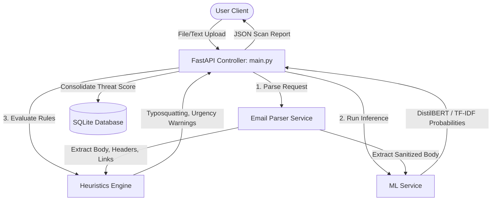

# System Architecture Guide

PhishGuard AI is structured using a modular Clean Architecture pattern to separate API boundaries, data pipelines, and threat detection engines.

## Architecture Schematic

## Core Subsystems

### 1. API Boundary (`backend/api/`)
FastAPI acts as the asynchronous entrypoint. It receives request payloads via multipart form data, delegates tasks to internal services, handles validation errors using Pydantic, and records scan transactions in the local database.

### 2. Services Layer (`backend/services/`)
- **Email Parser**: Handles EML standard compliance, Outlook OLE byte structures, and raw strings. Extracts key metadata headers (From, To, Date, Subject, ID), attachment counts, and extracts embedded URLs from HTML anchors and plain text.
- **ML Service**: Implements a dual-model framework. It attempts to load PyTorch DistilBERT weights first. If the library imports fail or model weights are missing on disk, it falls back to the fast Scikit-Learn Logistic Regression classifier. Includes internal hash caching to skip inference for recurring texts.
- **Heuristics Engine**: Performs standard static security checks:
  - Urgency indicator regex matching.
  - Typosquatting checks against popular brands (e.g. `micros0ft.com` vs `microsoft.com`).
  - Shortened URL checks (e.g. `bit.ly`).
  - Unicode/punycode homograph attack identification (e.g. domains starting with `xn--`).
  - Header comparison mismatches (e.g., mismatched From vs Reply-To domains).

### 3. Database Layer (`backend/database/`)
SQLite acts as the log transaction storage. SQLAlchemy ORM maps the schema representation. Every scan registers its filename, sender, subject, threat category, risk score, confidence level, and lists of triggered indicators.
