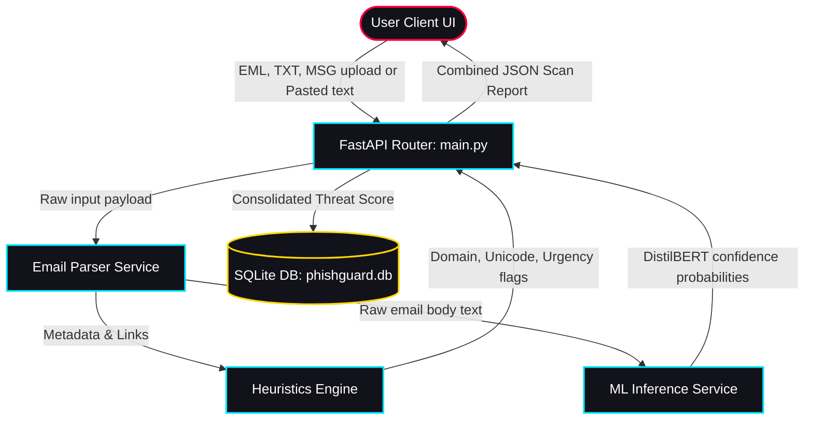

# System Architecture Diagram

This file contains the detailed layout flow diagram of PhishGuard AI using Mermaid notation.

## System Execution Sequence

1. **Upload**: User drags an `.eml` file into the dashboard.
2. **Parsing**: The parser extracts headers and parses message body attachments.
3. **Execution**:
   - The ML service runs TF-IDF vectorization and classifies text.
   - The Heuristics engine inspects links for typosquatting and checks header consistency.
4. **Resolution**: The API resolves ML labels vs heuristics scores and computes a threat rating.
5. **Logging**: The transaction details are saved into the SQLite database.
6. **Rendering**: The JSON payload is returned, updating the UI widgets.
